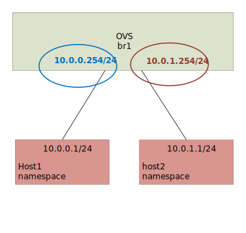
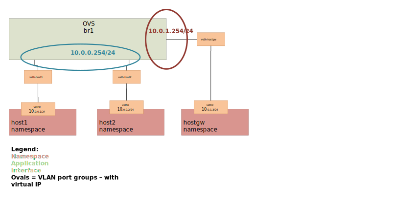
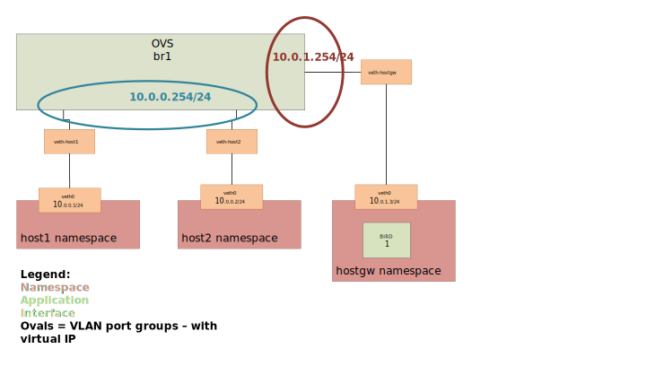
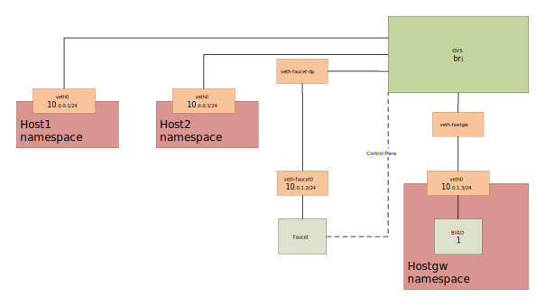

#TODO maybe setup everything and config except the routing stuff first. and show cannot ping between the two subnets?

This tutorial will cover routing with Faucet.

There are three types of routing we can use.
- Inter VLAN routing
- Static routing
- BGP via an external application (Quagga, Bird, EXABGP, ...)

This tutorial expands on [installing Faucet for the first time](https://faucet.readthedocs.io/en/latest/tutorials.html).
See there for how to install and setup Faucet and OVS.

For this tutorial it is a good idea to use a terminal multiplexer (screen, tmux or just multiple terminal sessions), as we will be running multiple applications at the same time.
# TODO maybe add a prefix to the code block on which terminal it should be executed??

## Routing between vlans
Let's start with a single switch connected to two hosts in two different vlans.

```bash
create_ns host1 10.0.0.254/24
create_ns host2 10.0.1.254/24
sudo ovs-vsctl add-br br1 \
-- set bridge br1 other-config:datapath-id=0000000000000001 \
-- set bridge br1 other-config:disable-in-band=true \
-- set bridge br1 fail_mode=secure \
-- add-port br1 veth-host1 -- set interface veth-host1 ofport_request=2 \
-- add-port br1 veth-host2 -- set interface veth-host2 ofport_request=3 \
-- set-controller br1 tcp:127.0.0.1:6653 tcp:127.0.0.1:6654
```


To allow traffic between vlans we use a router, and assign each VLAN at least one IP address (gateway IP address).
Lets add the routers and vlans section like so.

/etc/faucet/faucet.yaml
```yaml
vlans:
    vlan100:
        vid: 100
        faucet_vips: ["10.0.0.254/24"]
    vlan200:
        vid: 200
        faucet_vips: ["10.0.1.254/24"]

routers:
    router-1:
        vlans: [vlan100, vlan200]

dps:
    sw1:
        dp_id: 0x1
        hardware: "Open vSwitch"
        interfaces:
            1:
                name: "host1"
                description: "host1 network namespace"
                native_vlan: vlan100
            2:
                name: "host2"
                description: "host2 network namespace"
                native_vlan: vlan200
```
Send SIGHUP signal to reload the configuration file.
```
sudo pkill -HUP -f faucet.faucet
```
Add the default route to the 'faucet_vips' as above.
```bash
as_ns host1 ip route add default via 10.0.0.254 dev veth0
as_ns host2 ip route add default via 10.0.1.254 dev veth0
```
Then make some traffic between our two hosts.
```bash
as_ns host1 ping 10.0.1.2
```
It should work and traffic should go through.


## Static Routing
For this we will setup a Faucet switch with three hosts.
One of these hosts will act like a gateway,


Run the cleanup script to remove old namespaces and switches.
```bash
cleanup
```

Create 3 hosts, in 2 diffferent subnets:
```bash
create_ns host1 10.0.0.1/24
create_ns host2 10.0.0.2/24
create_ns hostgw 10.0.1.3/24
```

And add a default route for each host to it's gateway router.
```bash
as_ns host1 ip route add default via 10.0.0.254
as_ns host2 ip route add default via 10.0.0.254
as_ns hostgw ip route add default via 10.0.1.254
```

Create the bridge and add hosts 1, 2 and the gw to br1.
```bash
sudo ovs-vsctl add-br br1 \
-- set bridge br1 other-config:datapath-id=0000000000000001 \
-- set bridge br1 other-config:disable-in-band=true \
-- set bridge br1 fail_mode=secure \
-- add-port br1 veth-host1 -- set interface veth-host1 ofport_request=1 \
-- add-port br1 veth-host2 -- set interface veth-host2 ofport_request=2 \
-- add-port br1 veth-hostgw -- set interface veth-hostgw ofport_request=3 \
-- set-controller br1 tcp:127.0.0.1:6653 tcp:127.0.0.1:6654
```

For this Faucet configuration we will start from scratch.
First we need to define 2 VLANs.
1. hosts.
2. gw.

Here we have 3 new options:
- faucet_mac: The MAC address of Faucet's routing interface on this VLAN.
If we do not set faucet_mac for each VLAN, routed packets will be dropped unless 'drop_spoofed_faucet_mac' is set to false.
TODO explain above more.
- faucet_vips: The IP address for Faucet's routing interface on this VLAN.
Multiple IP addresses (IPv4 & IPv6) can be used.
- routes: Static routes for this VLAN.


```yaml
vlans:
    br1-hosts:
        vid: 100
        description: "h1 & h2's vlan"
        faucet_mac: "00:00:00:00:00:11"
        faucet_vips: ["10.0.0.254/24"]

    br1-gw:
        vid: 200
        description: "vlan for gw port"
        faucet_mac: "00:00:00:00:00:22"
        faucet_vips: ["10.0.1.254/24"]
        routes:
            - route:
                ip_dst: "0.0.0.0/24"
                ip_gw: '10.0.1.3/24'
```

As our routing interface is in a different VLAN, we will want to route between the two VLANs on the switch (br1-hosts & br1-peer).
So as with inter VLAN routing we will create a router for each switch.
```yaml
routers:
    router-br1:
        vlans: [br1-hosts, br1-gw]
```
And the rest of the config looks like this:
```yaml
dps:
    br1:
        dp_id: 0x1
        hardware: "Open vSwitch"
        interfaces:
            1:
                name: "host1"
                description: "host1 network namespace"
                native_vlan: br1-hosts
            2:
                name: "host2"
                description: "host2 network namespace"
                native_vlan: br1-hosts
            3:
                name: "gw:"
                description: "hostgw network namespace"
                native_vlan: br1-gw
```


Start/reload Faucet.
```
sudo systemctl restart faucet
```

and we should now be able to ping (the first few packets may get lost as ?arp? does it's thing).
```bash
root@ubuntu:~# as_ns host1 ping 10.0.1.3
PING 10.0.1.3 (10.0.1.3) 56(84) bytes of data.
64 bytes from 10.0.1.3: icmp_seq=2 ttl=62 time=0.625 ms
64 bytes from 10.0.1.3: icmp_seq=3 ttl=62 time=0.133 ms
64 bytes from 10.0.1.3: icmp_seq=4 ttl=62 time=0.064 ms
64 bytes from 10.0.1.3: icmp_seq=5 ttl=62 time=0.090 ms
```

## BGP Routing

# TODO This section is being updated and does not work.
For this section we are going to change our static routes from above into BGP routes.

BGP (and other routing) is provided by a NFV service, here we will use [BIRD](http://bird.network.cz/).
Other applications such as ExaBGP & Quagga could be used.

If you are NOT using the workshop VM you will need to install BIRD.

To install BIRD:
```bash
apt-get install flex bison libncurses5-dev libreadline-dev make
wget ftp://bird.network.cz/pub/bird/bird-1.6.4.tar.gz
tar -xf bird-1.6.4.tar.gz
cd bird-1.6.4
./configure
make
make install
```

Our dataplane will end up looking like this:


Note 1:
When using BGP and Faucet, if changing Faucet's routing configuration (routers, static routes, or a VLAN's BGP config) the Faucet application must be restarted to reload the configuration correctly (not sighup reloaded).

Remove the static routes added above:

/etc/faucet/faucet.yaml
```yaml
vlans:
    br1-hosts:
        vid: 100
        description: "h1 & h2's vlan"
        faucet_mac: "00:00:00:00:00:11"
        faucet_vips: ["10.0.0.254/24"]

    br1-gw:
        vid: 200
        description: "vlan for peering port"
        faucet_mac: "00:00:00:00:00:22"
        faucet_vips: ["10.0.1.254/24"]

routers:
    router-br1:
        vlans: [br1-hosts, br1-gw]

dps:
    br1:
        dp_id: 0x1
        hardware: "Open vSwitch"
        interfaces:
            1:
                name: "host1"
                description: "host1 network namespace"
                native_vlan: br1-hosts

            2:
                name: "host2"
                description: "host2 network namespace"
                native_vlan: br1-hosts
            3:
                name: "gw"
                description: "hostgw network namespace"
                native_vlan: br1-gw
```

Reload facuet
```
TODO does sighup work here?
```

And check that host1 can ping host2 but not the gw.
```bash
as_ns host1 ping 10.0.0.2
as_ns host1 ping 10.0.1.3
```

Next we will add faucet to our switch's dataplane so that it can communicate with the BGP speaking hostgw.


```bash
ip link add veth-faucet0 type veth peer name veth-faucet-dp
ovs-vsctl add-port br1 veth-faucet-dp -- set interface veth-faucet-dp ofport_request=4
ip addr add 10.0.1.2/24 dev veth-faucet0
```


To configure BIRD1
Create bird1.conf on $HOME
```
protocol kernel {
    scan time 60;
    import none;
}

protocol device {
    scan time 60;
}

protocol static {
    route 10.0.0.0/24 via 192.168.1.1;
    route 192.168.1.0/24 unreachable;
}

protocol bgp faucet {
    local as 64512;
    neighbor 172.16.1.1 port 9179 as 64512;
    export all;
    import all;
}

protocol bgp kiwi {
    local as 64512;
    neighbor 192.168.1.4 port 179 as 64513;
    export all;
    import all;
}
```

Start the two BIRDs
```bash
$ as_ns bgphost1 bird -s /var/run/bird1.ctl -c $HOME/bird1.conf
```

We'll configure the Faucets by adding the BGP configuration to the \*-peer VLAN.
/etc/faucet/faucet.yaml
```yaml
vlans:
    br1-hosts:
        vid: 100
        description: "h1 & h2's vlan"
        faucet_mac: "00:00:00:00:00:11"
        faucet_vips: ["10.0.0.254/24"]

    br1-gw:
        vid: 200
        description: "vlan for peering port"
        faucet_mac: "00:00:00:00:00:22"
        faucet_vips: ["10.0.1.254/24"]
        bgp_port: 9179
        bgp_as: 64512
        bgp_routerid: '172.16.1.1'
        bgp_neighbor_addresses: ['172.16.1.2', '::1']
        bgp_connect_mode: active
        bgp_neighbor_as: 64512

routers:
    br1-router:
        vlans: [br1-hosts, br1-gw]
```

And finally add the port configuration for the bgphost.
sw1-facuet.yaml
```yaml
dps:
    br1:
        ...
        interfaces:
            ...
            4:
                native_vlan: br1-peer

```
Now restart the Faucets.
```bash
sudo systemctl restart faucet
```

and our logs should show us BGP peer router up.

/var/log/faucet/faucet.log
```
...
May 03 11:23:40 faucet INFO     BGP peer router ID 172.16.1.2 AS 64512 up
May 03 11:23:40 faucet ERROR    BGP nexthop 192.168.1.1 for prefix 10.0.0.0/24 cannot be us
May 03 11:23:40 faucet ERROR    BGP nexthop 172.16.1.2 for prefix 192.168.1.0/24 is not a connected network
```
Now we should be able to ping from host1 to hostgw.

To confirm we are getting the routes from BGP we can query BIRD:
```bash
birdcl -s /var/run/bird2.ctl show route
BIRD 1.6.4 ready.
10.0.0.0/24        via 192.168.1.1 on veth0 [fruit 11:38:47 from 192.168.1.3] * (100) [AS64512i]
10.0.1.0/24        via 192.168.1.2 on veth0 [static1 11:31:29] * (200)
192.168.1.0/24     unreachable [static1 11:31:29] * (200)
                   unreachable [faucet 11:48:05 from 172.16.2.1] (100/-) [i]
                   via 192.168.1.3 on veth0 [fruit 11:38:47] (100) [AS64512i]
```
And we can see 10.0.0.0/24 is coming from our fruit peer.


# TODO how will we do this part with the updated bgp part above?
Next we will move host2 into a different subnet and add a route for it to be advertised via BGP.

Remove the old 10.0.0.0/24 IP address and add the new one.

```bash
as_ns host2 ip addr flush dev veth0
as_ns host2 ip addr add 10.0.2.2/24 dev veth0
as_ns host2 ip route add default via 10.0.2.254
```

And configure Faucet to put host 2 in a new VLAN.
```yaml
vlans:
    ...
    br1-host2:
        vid: 300
        faucet_mac: "00:00:00:00:00:34"
        faucet_vips: ["10.0.2.254/24"]
```

Add the VLAN to the Inter VLAN router:
```yaml
routers:
    router-br1:
        vlans: [br1-hosts, br1-peer, br1-host2]
```

And change port 2's native VLAN, so the final configuration should look like:
```yaml
vlans:
    br1-hosts:
        vid: 100
        description: "h1 & h2's vlan"
        faucet_mac: "00:00:00:00:00:11"
        faucet_vips: ["10.0.0.254/24"]
    br1-peer:
        vid: 200
        description: "vlan for peering port"
        faucet_mac: "00:00:00:00:00:22"
        faucet_vips: ["192.168.1.1/24"]
        bgp_port: 9179
        bgp_as: 64512
        bgp_routerid: '172.16.1.1'
        bgp_neighbor_addresses: ['172.16.1.2', '::1']
        bgp_connect_mode: active
        bgp_neighbor_as: 64512
    br1-host2:
        vid: 300
        faucet_mac: "00:00:00:00:00:34"
        faucet_vips: ["10.0.2.1/24"]

routers:
    router-br1:
        vlans: [br1-hosts, br1-peer, br1-host2]
dps:
    br1:
        dp_id: 0x1
        hardware: "Open vSwitch"
        interfaces:
            1:
                name: "br2"
                description: "connects to br2"
                native_vlan: br1-peer
            2:
                name: "host1"
                description: "host1 network namespace"
                native_vlan: br1-host2
            3:
                name: "host2"
                description: "host2 network namespace"
                native_vlan: br1-hosts
```

Restart Faucet 1 to reload our config and host2 should be able to ping host1, but not host3 & host4.

We need to advertise our new 10.0.2.0/24 via bgp.
So in the 'protocol static' section of bird1.conf add the new route.
```
protocol static {
    route 10.0.0.0/24 via 192.168.1.1;
    route 10.0.2.0/24 via 192.168.1.1
    route 192.168.1.0/24 unreachable;
}
```
reload bird:
```bash
$ sudo birdcl configure
```

And in bird2 we can view the routing table
```bash
$ sudo birdcl -s /var/run/bird2.ctl show route
BIRD 1.6.4 ready.
10.0.2.0/24        via 192.168.1.1 on veth0 [fruit 12:04:36 from 192.168.1.3] * (100) [AS64512i]
10.0.0.0/24        via 192.168.1.1 on veth0 [fruit 11:38:47 from 192.168.1.3] * (100) [AS64512i]
10.0.1.0/24        via 192.168.1.2 on veth0 [static1 11:31:29] * (200)
192.168.1.0/24     unreachable [static1 11:31:29] * (200)
                   unreachable [faucet 11:48:05 from 172.16.2.1] (100/-) [i]
                   via 192.168.1.3 on veth0 [fruit 11:38:47] (100) [AS64512i]
```
